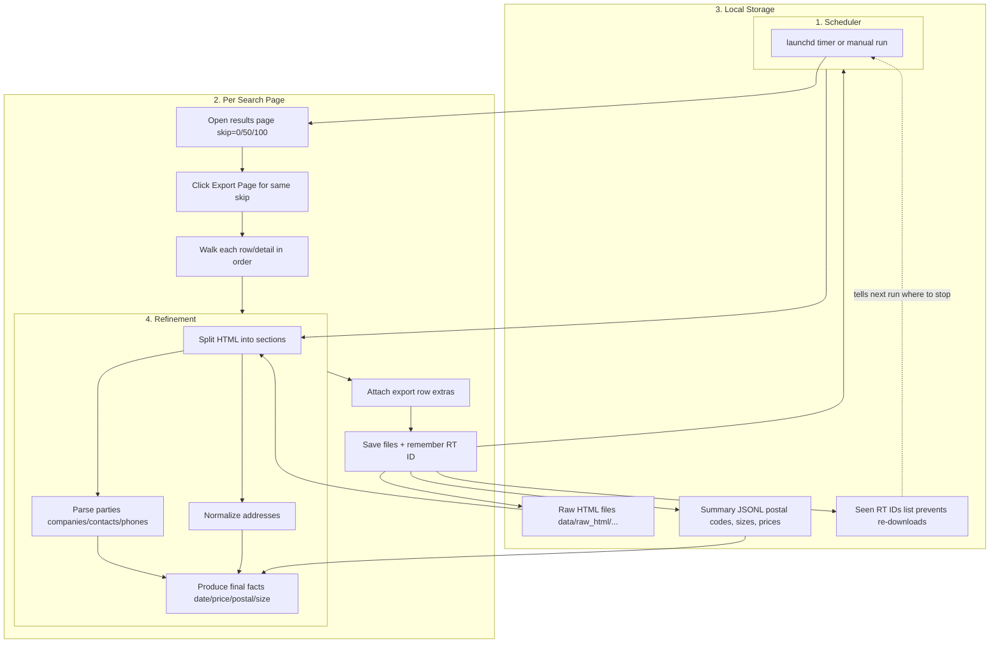

# RealTrack Ingestion Architecture (Plain-English)

This diagram shows, step-by-step, how each RealTrack transaction moves from the website into our local files and finally into the structured data that the app will use. No coding knowledge required. The scheduler node simply means "launchd or a manual CLI run kicks off the ingest around 9am, 11am, 2pm, and 4pm".

